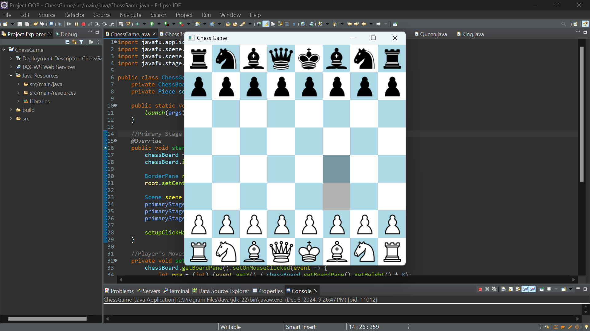
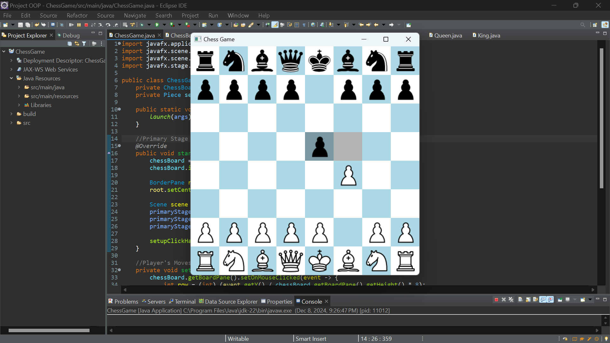
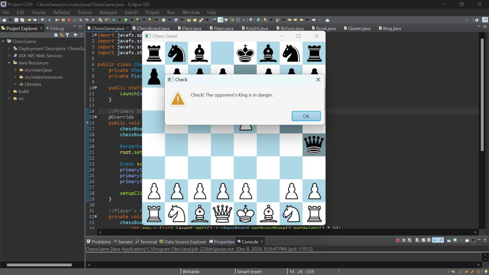
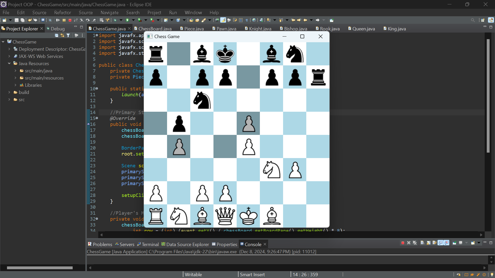
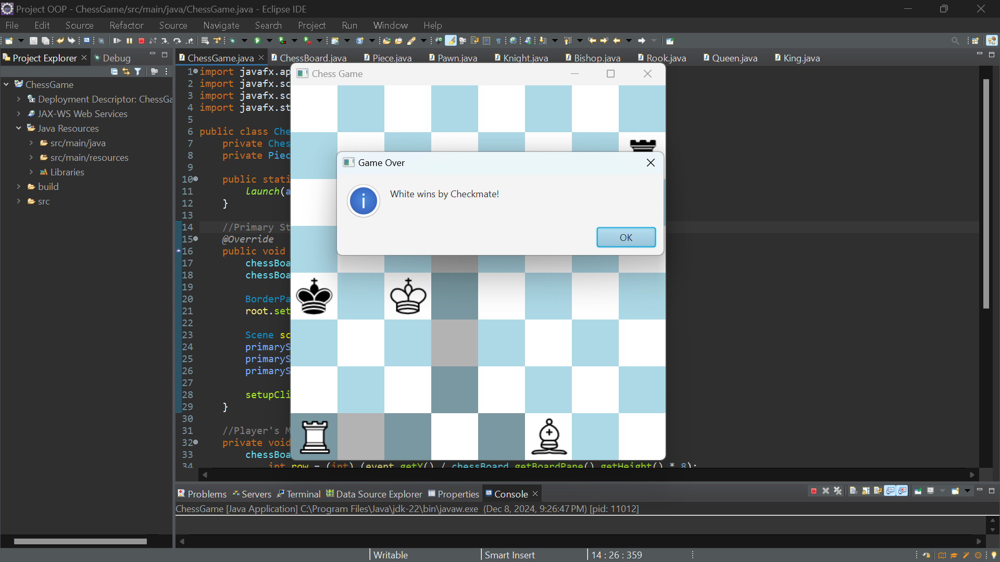

# Chess-Game

This is a fully functional chess game built using JavaFX. It allows players to play chess against each other. The game features a graphical interface with an intuitive and user-friendly design. It supports the basic movements and rules of chess.

## Features

- **Two-players:** Play against a friend on the same device.
- **Valid moves highlighting:** Displays valid moves for the selected piece.
- **Check and Checkmate detection:** Alerts the user when the king is in check or checkmate.
- **Piece Movement:** Supports all legal chess piece movements (king, queen, rook, bishop, knight, pawn).
- **Promotions:** Pawns can be promoted to any other piece (by default Queen) upon reaching the last rank.

## Technologies Used

- **JavaFX:** For building the graphical user interface.
- **Java:** For the backend logic and game mechanics.

## Installation

To run the Chess game on your local machine, you can open the project in an IDE like [Eclipse](https://www.eclipse.org/), build, and run the game directly.

## How to Play

1. **Start a Game:** Get a friend to play with.
2. **Move Pieces:** Click on the piece you want to move, then click on the destination square.
3. **Check and Checkmate:** The game will notify you when your king is in check or checkmate.
4. **End the Game:** The game ends when a player achieves checkmate or the game ends in a stalemate or draw.

## Game Play

  

  

## Contributions

This project welcomes any contributions to improve the game, add new features, or fix bugs.
